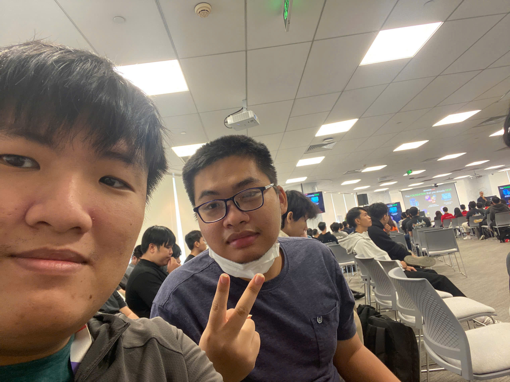

# Bài thu hoạch “Community Day 4/7 – Những Bài Học Không Chỉ Nằm Ở Công Nghệ”

### Mục Đích Của Sự Kiện

- Cung cấp góc nhìn thực tế về thị trường việc làm công nghệ và hành trang cần thiết cho người trẻ khi bước vào ngành.
- Chia sẻ kinh nghiệm làm việc qua nhiều môi trường và cách tư duy thiết kế hệ thống bắt đầu từ vấn đề.
- Hướng dẫn cách xây dựng sự hiện diện (visibility) và nâng cao kỹ năng giao tiếp trong môi trường làm việc.
- Định hướng cách sử dụng AI hiệu quả mà không phụ thuộc, kết hợp tư duy phát triển (growth mindset) và thái độ làm việc chuyên nghiệp.

### Danh Sách Diễn Giả

- Các chuyên gia và diễn giả khách mời từ cộng đồng công nghệ chia sẻ về thị trường việc làm, kinh nghiệm thực tế và kỹ năng mềm.

### Nội Dung Nổi Bật

#### Góc Nhìn Thực Tế Về Thị Trường Việc Làm Công Nghệ

- **Yêu cầu tuyển dụng ngày càng cao**: Ngay cả với vị trí thực tập, ứng viên cần xác định rõ mục tiêu công việc, tìm hiểu ngành đang tuyển dụng và nắm rõ yêu cầu của từng vị trí.
- **Tầm quan trọng của mạng lưới quan hệ**: Nhiều cơ hội việc làm được chia sẻ nội bộ hoặc qua giới thiệu, do đó việc xây dựng mối quan hệ và tăng sự hiện diện của bản thân là vô cùng cần thiết.
- **Xu hướng Cloud & AI**: Doanh nghiệp tiếp tục chuyển dịch lên cloud với nhu cầu nhân lực lớn nhưng ưu tiên người có kinh nghiệm. Đối với sinh viên và junior, AI là công cụ hỗ trợ học nhanh và thu hẹp khoảng cách, miễn là nắm vững kiến thức nền tảng và biết kiểm tra kết quả.

#### Bài Học Từ Hành Trình Làm Việc Đa Môi Trường

- **Trách nhiệm với sản phẩm**: Phải hiểu và chịu trách nhiệm với những gì mình xây dựng.
- **Ưu tiên yêu cầu nghiệp vụ**: Hiểu rõ yêu cầu đôi khi quan trọng hơn việc viết code quá đẹp.
- **Quy mô và kiến trúc**: Quy mô dữ liệu có thể làm thay đổi toàn bộ kiến trúc hệ thống.
- **Tốc độ và sự hoàn hảo**: Tốc độ thực thi đôi khi quan trọng hơn sự hoàn hảo tuyệt đối.
- **Tư duy thiết kế hệ thống**: Khi thiết kế hệ thống, luôn bắt đầu từ việc xác định rõ vấn đề trước khi chọn công cụ.

#### Nghệ Thuật Trở Nên “Visible” Hơn Trong Môi Trường Làm Việc

- **Định nghĩa đúng về Visibility**: Không phải là cố gắng gây chú ý mà bắt đầu từ những việc đơn giản như chủ động chào hỏi, đặt câu hỏi và tham gia tích cực vào các cuộc trò chuyện.
- **Tránh sự im lặng**: Nếu chỉ giữ im lặng, đồng nghiệp và quản lý sẽ khó nhận biết được năng lực cũng như những giá trị mà bạn có thể đóng góp.

#### Sử Dụng AI Thông Minh & Growth Mindset

- **Sử dụng AI không phụ thuộc**: Cần hiểu rõ vì sao AI đưa ra kết luận thay vì chỉ sao chép câu trả lời một cách máy móc.
- **Growth Mindset**: Luôn đặt câu hỏi, chấp nhận sai sót như một phần tất yếu của quá trình học hỏi và không ngừng phát triển bản thân.
- **Đánh giá từ doanh nghiệp**: Doanh nghiệp không chỉ nhìn vào kiến thức kỹ thuật mà còn quan tâm đặc biệt đến thái độ, kinh nghiệm, trải nghiệm và tiềm năng phát triển của ứng viên.

### Những Gì Học Được

#### Tư Duy Kỹ Thuật & Giải Quyết Vấn Đề

- **Nền tảng vững chắc**: Kiến thức kỹ thuật là cốt lõi nhưng cần đi kèm với tinh thần chủ động và khả năng giải quyết vấn đề linh hoạt.
- **Kiểm soát công cụ**: Biết cách sử dụng AI và các công nghệ mới làm đòn bẩy học tập nhưng vẫn giữ vững tư duy logic và kiểm chứng kết quả.

#### Kỹ Năng Mềm & Thái Độ Làm Việc

- **Chủ động kết nối**: Tăng cường sự hiện diện và tương tác trong môi trường làm việc nhóm để khẳng định giá trị bản thân.
- **Thái độ học hỏi lâu dài**: Công nghệ sẽ luôn thay đổi liên tục, nhưng việc tạo ra giá trị, chịu trách nhiệm và hoàn thiện bản thân giúp dễ dàng thích nghi với mọi biến động của thị trường.

### Ứng Dụng Vào Công Việc

- **Chủ động học hỏi và nâng cao nền tảng**: Tận dụng AI làm công cụ hỗ trợ nghiên cứu nhưng luôn kiểm chứng kỹ lưỡng các kết quả nhận được.
- **Tăng cường tương tác nhóm**: Áp dụng việc giao tiếp chủ động, đặt câu hỏi và tham gia tích cực vào các cuộc thảo luận chuyên môn để nâng cao sự hiện diện (visibility) trong công việc.
- **Phát triển Growth Mindset**: Duy trì thái độ cởi mở trước các sai sót, xem đó là cơ hội để tích lũy kinh nghiệm và phát triển bản thân bền vững trong ngành công nghệ.

### Trải nghiệm trong event

#### Góc nhìn thực tế từ chuyên gia
- Lắng nghe những chia sẻ thực chiến về thị trường lao động và các bài học quý giá từ những môi trường làm việc khác nhau.
- Hiểu rõ hơn về kỳ vọng của doanh nghiệp đối với nhân sự trẻ trong bối cảnh công nghệ biến động.

#### Bài học cốt lõi
- Kiến thức kỹ thuật cần song hành cùng thái độ tích cực, tinh thần chịu trách nhiệm và khả năng thích ứng linh hoạt.
- Xây dựng mối quan hệ và chủ động trong giao tiếp là chìa khóa mở ra nhiều cơ hội phát triển sự nghiệp.

#### Một số hình ảnh khi tham gia sự kiện
* Thêm các hình ảnh của các bạn tại đây

> Tổng thể, sự kiện mang đến những bài học sâu sắc không chỉ về chuyên môn công nghệ mà còn trang bị tư duy nghề nghiệp, thái độ làm việc và kỹ năng hòa nhập môi trường thực tế cho người làm công nghệ trẻ.
>
> 