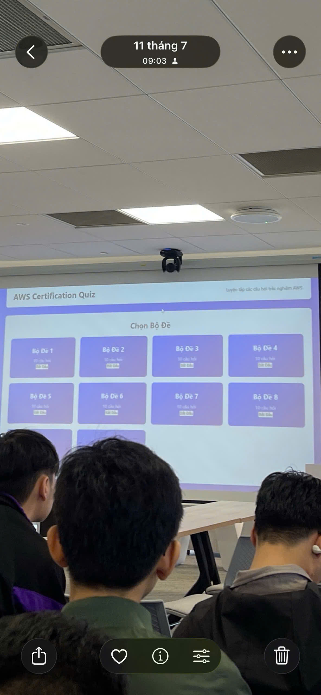

# Bài thu hoạch “SLA, Giám Sát, Bảo Mật Thông Minh Với AWS Security Agent Và Định Hướng Chứng Chỉ AWS”

### Mục Đích Của Sự Kiện

- Hiểu rõ tầm quan trọng của SLA (Service Level Agreement) và cách xây dựng chiến lược giám sát (Monitoring) toàn diện từ hạ tầng đến trải nghiệm người dùng cuối.
- Khám phá giải pháp bảo mật tự động hóa tiên tiến với **AWS Security Agent** (vận hành bởi Amazon Bedrock) xuyên suốt vòng đời phát triển phần mềm.
- Cung cấp bức tranh tổng quan và cấu trúc các miền kiến thức trọng tâm trong kỳ thi chứng chỉ nền tảng **AWS Cloud Practitioner**.

### Danh Sách Diễn Giả

- Các chuyên gia và diễn giả khách mời từ cộng đồng công nghệ chia sẻ về quản trị hệ thống, an ninh mạng bảo mật đám mây và lộ trình chứng chỉ AWS.

### Nội Dung Nổi Bật

#### 1. SLA and Monitoring — From SLA to Monitoring What Really Matters

- **Khái niệm về SLA (Service Level Agreement)**: Cam kết chính thức về mức kỳ vọng dịch vụ giữa nhà cung cấp và khách hàng. SLA giúp định hình kỳ vọng rõ ràng, đề cao trách nhiệm giải trình, đo lường hiệu năng và quản trị rủi ro hiệu quả.
- **Vai trò của Giám sát (Monitoring)**: Nằm bên trong quản trị rủi ro giúp phát hiện sớm các vấn đề trước khi ảnh hưởng đến SLA. Quy trình chuẩn bao gồm: Phát hiện rủi ro → Thu thập tín hiệu (metrics, logs, alarms) → Phản ứng (kích hoạt thông báo SNS, SOP, khôi phục hệ thống) → Cải tiến và phòng ngừa tái diễn.
- **Mô hình Kim Tự Tháp Giám Sát**:
  - **Customer Experience (Đỉnh kim tự tháp)**: Trải nghiệm thực tế của người dùng cuối.
  - **Business**: Tỷ lệ đăng nhập thành công, số lượng đơn hàng, doanh thu.
  - **Application**: Độ trễ (Latency), tỷ lệ lỗi (Errors), lưu lượng request.
  - **Infrastructure**: Trạng thái tài nguyên CPU, Memory, Disk, Network.
  - **Cloud Provider (Đáy kim tự tháp)**: Trạng thái các dịch vụ cốt lõi EC2, RDS, ALB, S3.
- **Bài học thực tế**: 
  - *Healthy infrastructure ≠ Happy users*: Hạ tầng hoạt động tốt chưa chắc người dùng đã có trải nghiệm tốt (health check pass nhưng app vẫn lỗi).
  - Trách nhiệm của nhà cung cấp đám mây dừng ở hạ tầng, còn chúng ta phải chịu trách nhiệm hoàn toàn về trải nghiệm của người dùng.

#### 2. Securing Your Web Apps With AWS Security Agent

- **Điểm nghẽn trong kiểm thử bảo mật truyền thống**: Các đợt Pentest thủ công kéo dài nhiều tuần, chi phí đắt đỏ (5.000$ – 20.000$) và phụ thuộc lớn vào trình độ của chuyên gia.
- **Giải pháp Frontier Agent (AWS Security Agent)**:
  - Vận hành bởi Amazon Bedrock, có khả năng tự lên kế hoạch và thực thi các tác vụ bảo mật phức tạp mà không cần con người can thiệp.
  - Kiểm chứng lỗ hổng bằng cách thực hiện khai thác thực tế: Phân tích tài liệu kiến trúc (chuẩn PCI DSS, NIST CSF, AWS Well-Architected), scan PRs tự động tìm mã độc/secret bị rò rỉ, và tấn công mô phỏng đa bước.
- **Bảo vệ toàn bộ vòng đời phát triển (Full Lifecycle)**: Bao gồm Design Review, Code Security và Active Penetration Testing, hỗ trợ tích hợp trực tiếp vào GitHub/GitLab Pull Requests kèm đề xuất bản vá tự động (Auto-PR Fixes).
- **Các giới hạn cần lưu ý**: Bị gián đoạn bởi các cơ chế xác thực phức tạp (MFA, Biometrics, mTLS), gặp khó khăn với lỗi logic thiếu ngữ cảnh nghiệp vụ, và tốn thời gian thực thi với ứng dụng lớn.

#### 3. Inside The Exam — AWS Cloud Practitioner

- **Đặc điểm chứng chỉ**: Chứng chỉ nền tảng tập trung vào tư duy và bức tranh tổng quan về AWS Cloud, không yêu cầu kỹ năng lập trình hay cấu hình quá chuyên sâu.
- **Cấu trúc 4 miền kiến thức (Domains)**:
  - **Domain 1**: Cloud Concepts (24%).
  - **Domain 2**: Security and Compliance (30%).
  - **Domain 3**: Cloud Technology and Services (34%).
  - **Domain 4**: Billing, Pricing, and Support (12%).

### Những Gì Học Được

#### Tư Duy Giám Sát & Quản Trị Vận Hành

- Hiểu rõ mối quan hệ mật thiết giữa SLA và chiến lược quản trị rủi ro hệ thống.
- Nắm vững mô hình Kim Tự Tháp Giám Sát để ưu tiên theo dõi từ trải nghiệm người dùng thực tế xuống tận tầng hạ tầng cloud.

#### Tư Duy An Ninh Mạng & Công Nghệ AI Bảo Mật

- Tiếp cận mô hình tự động hóa bảo mật toàn diện (Full Lifecycle) nhờ tích hợp trợ lý AI thông minh như AWS Security Agent vào quy trình CI/CD.
- Nhận thức rõ các giới hạn của công cụ tự động để kết hợp linh hoạt cùng chuyên gia con người trong các tình huống phức tạp.

### Ứng Dụng Vào Công Việc

- **Xây dựng hệ thống giám sát đa lớp**: Thiết lập cảnh báo và thu thập metrics bám sát theo mô hình Kim Tự Tháp Giám Sát để tối ưu trải nghiệm người dùng.
- **Tích hợp kiểm tra bảo mật tự động**: Áp dụng các giải pháp scan mã nguồn và kiểm tra lỗ hổng tích hợp vào quy trình phát triển phần mềm hàng ngày.
- **Nâng cao kiến thức nền tảng đám mây**: Định hướng ôn tập và củng cố các miền kiến thức theo cấu trúc chuẩn của chứng chỉ AWS Cloud Practitioner.

### Trải nghiệm trong event

#### Góc nhìn thực tế từ chuyên gia
- Lắng nghe những chia sẻ chuyên sâu về cách thiết lập cam kết chất lượng dịch vụ (SLA) và hệ thống giám sát thực chiến tại các doanh nghiệp.
- Cập nhật các xu hướng ứng dụng AI mới nhất vào lĩnh vực an ninh mạng và kiểm thử bảo mật.

#### Bài học cốt lõi
- Giám sát không chỉ là theo dõi hạ tầng mà phải lấy trải nghiệm người dùng làm trung tâm.
- An ninh mạng cần được đưa vào tự động hóa ngay từ các bước thiết kế và phát triển phần mềm (Shift-Left Security).

#### Một số hình ảnh khi tham gia sự kiện
* Thêm các hình ảnh của các bạn tại đây

> Tổng kết lại, sự kiện đã trang bị cho tôi những kiến thức vô cùng giá trị về kỹ thuật giám sát nâng cao, công nghệ bảo mật tự động dựa trên AI và định hướng rõ ràng cho hành trình chinh phục các chứng chỉ chuyên nghiệp trên nền tảng AWS.
>
> 